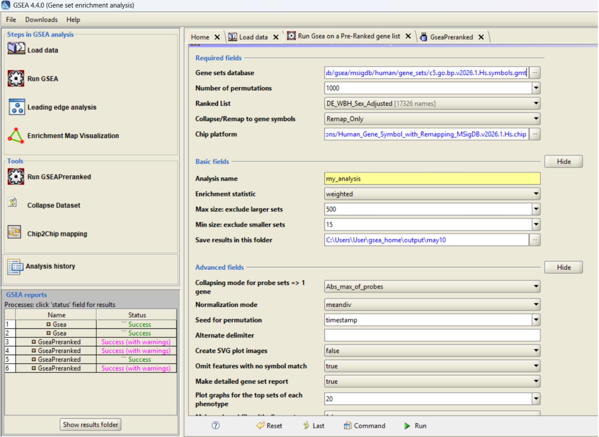
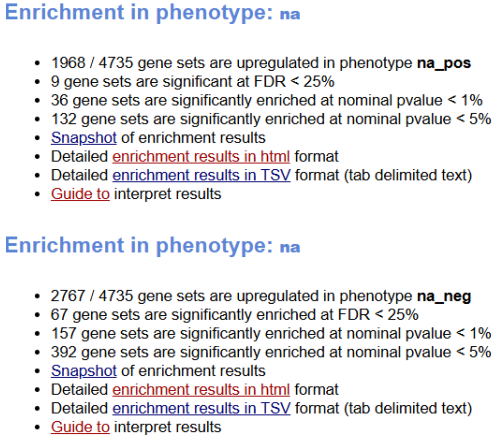
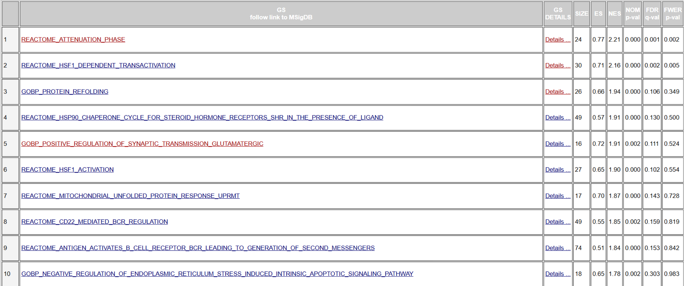
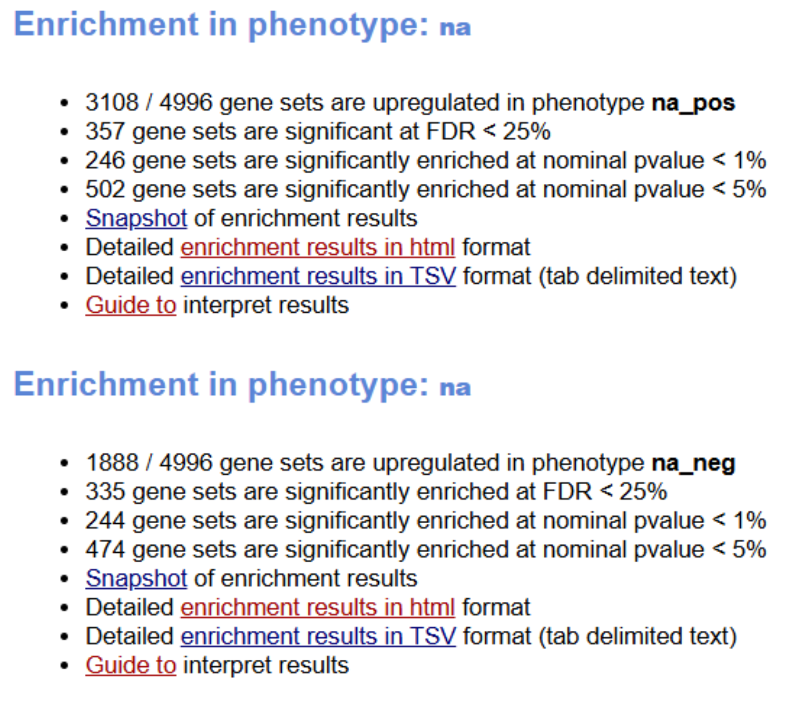
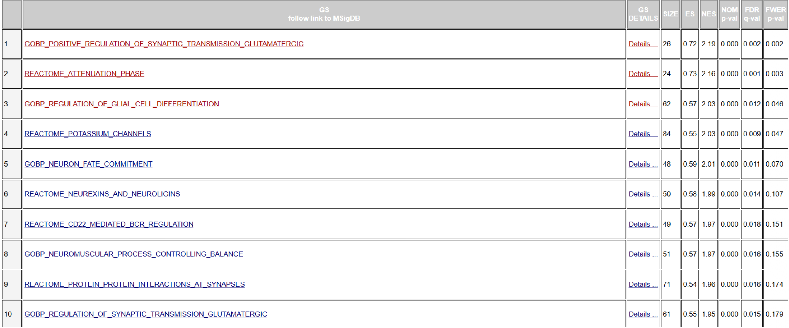

```{r setup, include=FALSE}
knitr::opts_chunk$set(
  echo        = TRUE,
  message     = FALSE,
  warning     = FALSE,
  fig.align   = "center",
  fig.width   = 8,
  fig.height  = 5,
  out.width   = "85%",
  dpi         = 150
)
```

## Overview

This analysis starts from the STAR-derived raw gene count matrix (`wbh_counts_matrix.csv`) and walks through quality filtering, differential expression with DESeq2, and a custom implementation of Gene Set Enrichment Analysis (GSEA). We test four biologically motivated gene sets, heat shock/proteostasis, interferon signaling, serotonin, and dopamine, for coordinated expression changes between Whole Body Hyperthermia (WBH)-treated and sham-treated samples.

## Biological Context

This dataset contains RNA-bulk sequencing data from 19 whole blood samples of individuals with Major Depressive Disorder (MDD), collected 30 minutes after Whole Body Hyperthermia (WBH) treatment or sham treatment. This data is referenced from Akonom et. al’s paper (https://doi.org/10.1016/j.bbih.2026.101225), with more specific information regarding individual sample metadata found at (https://www.ncbi.nlm.nih.gov/Traces/study/?acc=PRJNA1287674&o=acc_s%3Aa). The original study aimed to compare the whole-blood transcriptomic response in hopes of identifying how biological pathways relevant to MDD may have been affected post-WBH, especially since WBH individuals exhibited sustained antidepressant effects without the side effects typically posed by common antidepressant drugs. We hope to recapitulate the upregulation in heat shock and immune pathways observed in the pathway, while also investigating if there are enrichment in molecular mechanism pathways related to neurotransmitters such as dopamine and serotonin (that current pharmacotherapies typically act on).

## Load libraries

```{r load-libraries}
library(AnnotationDbi)
library(org.Hs.eg.db)
library(GO.db)
library(edgeR)
library(DESeq2)
library(tidyverse)
library(gt)
```

## Load raw STAR count matrix

Column names are cleaned of BAM and tab-file suffixes added by STAR (RNA-seq alignment software), and Ensembl gene IDs are mapped to HGNC (gene id) symbols using `org.Hs.eg.db` to match the notation typically used in GSEA gene sets for better compatability. Genes with no matching symbol retain their Ensembl ID, and all row names are made unique before downstream use to avoid errors and resolve possible multimapping (possibility that Ensembl IDs may map to the same gene symbol due to transcriptional variants or overlapping loci.).

```{r load-counts}
cnt <- read.csv(
  "wbh_counts_matrix.csv",
  row.names = 1,
  check.names = FALSE
)
cnt <- as.matrix(cnt)

# Clean sample names if STAR/BAM suffixes are present.
colnames(cnt) <- basename(colnames(cnt))
colnames(cnt) <- sub("\\.Aligned\\.sortedByCoord\\.out\\.bam$", "", colnames(cnt))
colnames(cnt) <- sub("\\.ReadsPerGene\\.out\\.tab$", "", colnames(cnt))

# Remove version numbers if present (e.g., ENSG... .1)
ensembl_ids <- sub("\\..*$", "", rownames(cnt))

gene_annot <- AnnotationDbi::select(
  org.Hs.eg.db,
  keys = ensembl_ids,
  columns = c("SYMBOL"),
  keytype = "ENSEMBL"
)

# Match annotation back to count matrix
gene_symbols <- gene_annot$SYMBOL[match(ensembl_ids, gene_annot$ENSEMBL)]

# Replace missing symbols with Ensembl IDs
gene_symbols[is.na(gene_symbols)] <- ensembl_ids[is.na(gene_symbols)]

# Ensure uniqueness (required for DESeq2)
gene_symbols <- make.unique(gene_symbols)
rownames(cnt) <- gene_symbols

# Sanity checks
if (any(is.na(cnt))) {
  stop("NA values detected in count matrix.")
}
if (any(cnt < 0)) {
  stop("Negative values detected. DESeq2 requires non-negative raw counts.")
}

# Inspect dimensions and first columns
dim(cnt)
head(cnt[, 1:min(4, ncol(cnt))])
```

## Define Sham versus WBH groups

Each of the 19 samples are assigned to either the WBH group (10 samples) or the Sham group (9 samples) using a manually curated sample table keyed by SRR accession. `Sham` is set as the reference level throughout. A design matrix with an intercept and a `groupWBH` indicator is created for modeling. The intercept represents the baseline level of expression (control) while the group indicator models the change caused by the experimental group using a variable (0 for sham, 1 for WBH) to represent the difference between the reference and WBH groups.

```{r define-groups}
sample_info <- tibble(
  sample = c(
    "SRR34413163", "SRR34413164", "SRR34413165", "SRR34413166", "SRR34413167",
    "SRR34413168", "SRR34413169", "SRR34413170", "SRR34413171", "SRR34413172",
    "SRR34413174", "SRR34413175", "SRR34413176", "SRR34413177",
    "SRR34413178", "SRR34413179", "SRR34413180", "SRR34413181", "SRR34413182"
  ),
  group = c(
    rep("WBH", 10),
    rep("Sham", 9)
  )
) %>%
  mutate(group = factor(group, levels = c("Sham", "WBH"))) %>%
  as.data.frame()

rownames(sample_info) <- sample_info$sample

# Match count columns to sample metadata.
missing_samples <- setdiff(sample_info$sample, colnames(cnt))
extra_samples   <- setdiff(colnames(cnt), sample_info$sample)

if (length(missing_samples) > 0) {
  stop(paste("Samples in sample_info but missing from cnt:",
             paste(missing_samples, collapse = ", ")))
}
if (length(extra_samples) > 0) {
  message("Samples in cnt but not sample_info will be dropped: ",
          paste(extra_samples, collapse = ", "))
}

cnt <- cnt[, sample_info$sample]

# create a group level vector
group  <- sample_info$group

# create design matrix
design <- model.matrix(~ group)

group
design
```

## Filter genes by CPM

Lowly expressed genes are removed by retaining only those with a count-per-million (CPM) greater than 1 in at least 2 samples. This step eliminates genes that are essentially absent from the data, since they will contribute more noise than true signal in analysis. This also increases computational testing efficiency and decreases the multiple testing burden (thereby increasing the statistical power to find meaningful differences in remaining genes) A `DGEList` object is then constructed and TMM normalization factors are computed.

```{r filter-genes}
cpm_vals     <- cpm(cnt)
keep         <- rowSums(cpm_vals > 1) >= 2
cnt_filtered <- cnt[keep, ]

filter_summary <- tibble(
  genes_before_filtering = nrow(cnt),
  genes_after_filtering  = nrow(cnt_filtered),
  genes_removed          = nrow(cnt) - nrow(cnt_filtered)
)
filter_summary

# Store counts and phenotype labels together
dge <- DGEList(
  counts  = cnt_filtered,
  group   = sample_info$group,
  samples = sample_info
)

# Add library sizes and normalization factors
dge <- calcNormFactors(dge)

# Confirm that phenotype labels are stored
dge$samples
```

## Run DESeq2

DESeq2 is used to fit a negative-binomial model (accounts for overdispersion typically seen in RNA-seq data) for each gene with group as the sole covariate, contrasting WBH against Sham.

```{r run-deseq2}
dds <- DESeqDataSetFromMatrix(
  countData = cnt_filtered,
  colData   = sample_info,
  design    = ~ group
)

# Ensure Sham is the reference level.
dds$group <- relevel(dds$group, ref = "Sham")
dds       <- DESeq(dds)

res <- results(
  dds,
  contrast = c("group", "WBH", "Sham")
)

summary(res)

res_df <- as.data.frame(res) %>%
  rownames_to_column("gene_id") %>%
  arrange(padj)

head(res_df)
```

## Create ranked gene list for GSEA by log2 fold change

GSEA requires a gene list ranked by a metric that captures the magnitude of differential expression. Here we use the DESeq2 log2 fold change (WBH vs. Sham), sorted in decreasing order so that the most upregulated genes appear at the top of the list.

```{r ranked-gene-list}
gsea_ranked_log2fc <- res_df %>%
  dplyr::filter(!is.na(log2FoldChange)) %>%
  dplyr::select(gene_id, log2FoldChange) %>%
  dplyr::arrange(desc(log2FoldChange))

head(gsea_ranked_log2fc)
```

## Define gene sets for GSEA from GO IDs

Gene sets are assembled by querying `org.Hs.eg.db` for Biological Process GO terms whose descriptions match four keywords of interest: *heat/chaperone/protein folding/proteostasis*, *interferon*, *serotonin*, and *dopamine*. Only genes present in the ranked list are retained, giving four gene sets of sizes ranging from 46 (serotonin) to 374 (interferon signaling).

```{r define-gene-sets}
# Create named ranked vector for GSEA (gene -> statistic)
ranked_stats        <- gsea_ranked_log2fc$log2FoldChange
names(ranked_stats) <- gsea_ranked_log2fc$gene_id
ranked_stats        <- sort(ranked_stats, decreasing = TRUE)

# Map gene symbols to GO terms (Biological Process only)
go_map <- AnnotationDbi::select(
  org.Hs.eg.db,
  keys    = keys(org.Hs.eg.db, keytype = "SYMBOL"),
  columns = c("SYMBOL", "GO", "ONTOLOGY"),
  keytype = "SYMBOL"
) %>%
  filter(!is.na(GO), ONTOLOGY == "BP")

# Retrieve GO term names (Biological Process ontology)
go_terms <- AnnotationDbi::select(
  GO.db,
  keys    = keys(GO.db),
  columns = c("TERM", "ONTOLOGY"),
  keytype = "GOID"
) %>%
  dplyr::filter(ONTOLOGY == "BP")

# Create mapping: GO ID -> gene symbols
go2gene <- split(go_map$SYMBOL, go_map$GO)

# Identify relevant GO terms by keyword matching
heat_go_ids <- go_terms %>%
  filter(str_detect(
    TERM,
    regex("heat|chaperone|protein folding|protein refolding|proteostasis",
          ignore_case = TRUE)
  )) %>%
  pull(GOID)

interferon_go_ids <- go_terms %>%
  filter(str_detect(TERM, regex("interferon", ignore_case = TRUE))) %>%
  pull(GOID)

serotonin_go_ids <- go_terms %>%
  filter(str_detect(TERM, regex("serotonin", ignore_case = TRUE))) %>%
  pull(GOID)

dopamine_go_ids <- go_terms %>%
  filter(str_detect(TERM, regex("dopamine", ignore_case = TRUE))) %>%
  pull(GOID)

# Build gene sets from selected GO terms
gene_sets <- list(
  heat_shock_proteostasis = unique(unlist(go2gene[heat_go_ids])),
  interferon_signaling    = unique(unlist(go2gene[interferon_go_ids])),
  serotonin               = unique(unlist(go2gene[serotonin_go_ids])),
  dopamine                = unique(unlist(go2gene[dopamine_go_ids]))
)

# Keep only genes present in the ranked list
gene_sets <- lapply(gene_sets, function(gs) {
  intersect(unique(gs), names(ranked_stats))
})

# Summarize gene set sizes after filtering
gene_set_summary <- tibble(
  gene_set               = names(gene_sets),
  n_genes_in_ranked_list = sapply(gene_sets, length)
)
gene_set_summary
```

## Define Enrichment Score function

The enrichment score (ES) is computed using the weighted Kolmogorov–Smirnov-like statistic from the original Subramanian et al. (2005) paper. At each position in the ranked gene list, the running sum increases by the gene's absolute fold-change (weighted hit) if the gene belongs to the set, and decreases by an equal penalty otherwise. The ES is the maximum absolute deviation of this running sum from zero.

```{r es-function}
gsea_es <- function(ranked_stats, gene_set, p = 1) {
  genes <- names(ranked_stats)
  N     <- length(genes)
  hits  <- genes %in% gene_set
  Nh    <- sum(hits)

  if (Nh == 0) return(NA)

  # Compute weights
  weights <- abs(ranked_stats)^p

  # Normalization constants
  NR <- sum(weights[hits])

  # Initialize cumulative vectors
  Phit  <- numeric(N)
  Pmiss <- numeric(N)

  # Compute cumulative sums explicitly
  hit_cum  <- 0
  miss_cum <- 0

  for (i in seq_len(N)) {
    if (hits[i]) {
      hit_cum  <- hit_cum  + weights[i] / NR
    } else {
      miss_cum <- miss_cum + 1 / (N - Nh)
    }
    Phit[i]  <- hit_cum
    Pmiss[i] <- miss_cum
  }

  running_score <- Phit - Pmiss

  # Enrichment score = max absolute deviation
  ES <- running_score[which.max(abs(running_score))]

  return(list(
    ES            = ES,
    running_score = running_score,
    Phit          = Phit,
    Pmiss         = Pmiss
  ))
}
```

## Permutation Test for Normalized Enrichment Score (NES) and P-value

Statistical significance is assessed via phenotype permutation. Rather than refitting the full DESeq2 model 1,000 times (which would be prohibitively slow), we permute sample labels and recompute a fast ranking statistic: the difference in mean log-CPM between the permuted WBH and Sham groups. The observed ES for each gene set is then normalized by the mean of the same-sign null ES values to produce the NES, and an empirical p-value is derived from the fraction of permutations with a null |ES| greater than or equal to the observed |ES|. Multiple testing correction uses both Benjamini–Hochberg (BH) and Storey's q-value.

```{r permutation-test}
# phenotype permutation using logCPM mean differences
logcpm <- edgeR::cpm(dge, log = TRUE, prior.count = 1)

rank_from_labels <- function(logcpm, group) {
  group <- factor(group, levels = c("Sham", "WBH"))
  stat  <- rowMeans(logcpm[, group == "WBH",  drop = FALSE]) -
           rowMeans(logcpm[, group == "Sham", drop = FALSE])
  sort(stat, decreasing = TRUE)
}

compute_NES <- function(observed_ES, null_dist) {
  if (is.na(observed_ES)) return(NA_real_)
  if (observed_ES >= 0) {
    pos_null <- null_dist[null_dist >= 0]
    if (length(pos_null) == 0 || mean(pos_null) == 0) return(NA_real_)
    observed_ES / mean(pos_null)
  } else {
    neg_null <- null_dist[null_dist < 0]
    if (length(neg_null) == 0 || mean(abs(neg_null)) == 0) return(NA_real_)
    observed_ES / mean(abs(neg_null))
  }
}

gsea_pheno_perm <- function(dge, gene_sets, observed_ranked_stats, nperm = 1000) {
  logcpm <- edgeR::cpm(dge, log = TRUE, prior.count = 1)

  observed_ES <- sapply(gene_sets, function(gs) {
    gsea_es(observed_ranked_stats, gs)$ES
  })

  null_mat <- matrix(
    NA_real_,
    nrow     = nperm,
    ncol     = length(gene_sets),
    dimnames = list(NULL, names(gene_sets))
  )

  for (b in seq_len(nperm)) {
    perm_group         <- sample(dge$samples$group)
    perm_ranked_stats  <- rank_from_labels(logcpm, perm_group)
    null_mat[b, ]      <- sapply(gene_sets, function(gs) {
      gsea_es(perm_ranked_stats, gs)$ES
    })
  }

  pvalues <- sapply(seq_along(gene_sets), function(j) {
    mean(abs(null_mat[, j]) >= abs(observed_ES[j]), na.rm = TRUE)
  })

  NES <- sapply(seq_along(gene_sets), function(j) {
    compute_NES(
      observed_ES = observed_ES[j],
      null_dist   = null_mat[, j]
    )
  })

  gsea_df <- tibble(
    gene_set = names(gene_sets),
    ES       = observed_ES,
    NES      = NES,
    pvalue   = pvalues,
    padj_BH  = p.adjust(pvalues, method = "BH")
  ) %>%
    arrange(pvalue)

  lambda    <- 0.5
  pi0_storey <- min(1, mean(gsea_df$pvalue > lambda, na.rm = TRUE) / (1 - lambda))

  gsea_df <- gsea_df %>%
    mutate(
      pi0_storey    = pi0_storey,
      qvalue_storey = pi0_storey * pvalue
    )

  return(gsea_df)
}

set.seed(114)
gsea_df <- gsea_pheno_perm(
  dge                  = dge,
  gene_sets            = gene_sets,
  observed_ranked_stats = ranked_stats,
  nperm                = 1000
)
```

## GSEA Results

None of the four gene sets reach statistical significance after multiple-testing correction (all BH-adjusted p-values >= 0.844). The heat shock/proteostasis set shows the most positive NES (1.103), consistent with the expected cellular response to elevated temperature, while the dopamine, serotonin, and interferon sets all have negative NES values, suggesting slight depletion relative to chance.

These results are likely affected by the use of phenotype permutations with a limited sample size. With only 19 individuals, the number of distinct phenotype relabelings is limited, and random shuffles can produce enrichment scores similar to the observed score when the biological signal is subtle. The ranked list here uses log2 fold change only; an alternative weighted statistic such as `sign(log2FC) * -log10(pvalue)` may prioritize genes that are both strongly changed and statistically reliable.


```{r gsea-results}
gene_set_labels <- c(
  heat_shock_proteostasis = "Heat Shock Proteostasis",
  dopamine                = "Dopamine",
  serotonin               = "Serotonin",
  interferon_signaling    = "Interferon Signaling"
)

gsea_df <- gsea_df %>%
  mutate(
    gene_set = recode(gene_set, !!!gene_set_labels)
  )

gsea_table <- gsea_df |>
  gt() |>
  tab_header(
    title    = "Gene Set Enrichment Analysis Results",
    subtitle = "Summary of enrichment scores and significance metrics"
  ) |>
  cols_label(
    gene_set      = "Gene Set",
    ES            = "ES",
    NES           = "NES",
    pvalue        = "P-value",
    padj_BH       = "Adj. P (BH)",
    pi0_storey    = "Pi0 (Storey)",
    qvalue_storey = "Q-value"
  ) |>
  fmt_number(columns = c(ES, NES), decimals = 3) |>
  fmt_number(columns = c(pvalue, padj_BH, qvalue_storey), decimals = 3) |>
  tab_style(
    style     = cell_text(weight = "bold"),
    locations = cells_column_labels(everything())
  ) |>
  cols_align(align = "center", columns = -gene_set) |>
  tab_options(
    table.font.size     = 10,
    table.width         = pct(100),
    data_row.padding    = px(3),
    column_labels.padding = px(3)
  )

gsea_table
```

## Plotting Enrichment Scores

The bar chart below displays the absolute NES for each gene set, colored by its BH-adjusted p-value. Redder bars indicate lower (more significant) adjusted p-values, while bluer bars indicate higher (less significant) values. 

```{r bar-plot, fig.height=4}
ggplot(gsea_df, aes(x = gene_set, y = abs(NES), fill = padj_BH)) +
  geom_col() +
  coord_flip() +
  scale_fill_gradient(
    low  = "red",
    high = "blue",
    name = "BH adjusted\np-value"
  ) +
  labs(
    title = "GSEA Results by Gene Set",
    x     = "Gene set",
    y     = "Normalized Enrichment Score"
  ) +
  theme_minimal()
```

The running enrichment score plots below show, for each gene set, how the cumulative sum evolves as we walk down the ranked gene list from most upregulated (left) to most downregulated (right). Tick marks on the x-axis indicate where gene-set members appear in the list; the dotted vertical line marks the position of the maximum absolute deviation (the reported ES).

```{r es-plot-function}
plot_gsea_es <- function(ranked_stats, gene_set, gene_set_name) {
  es <- gsea_es(ranked_stats, gene_set)

  plot(
    es$running_score,
    type = "l",
    lwd  = 2,
    col  = "green",
    xlab = "Gene Rank in Ordered List",
    ylab = "Running Enrichment Score (ES)",
    main = paste("GSEA Enrichment Score:", gene_set_name)
  )
  abline(h = 0, lty = 2)

  hit_positions <- which(names(ranked_stats) %in% gene_set)
  rug(hit_positions)

  abline(
    v   = which.max(abs(es$running_score)),
    lty = 3
  )
}
```

### Heat Shock / Proteostasis

The heat shock gene set (293 genes) shows a broad positive enrichment: the running score climbs steadily through the upper half of the ranked list before falling back, with its peak (ES = 0.215) occurring around rank 8,000. This pattern is consistent with mild but diffuse upregulation of chaperones and proteostasis genes following WBH treatment.

```{r es-heat, fig.height=4.5}
plot_gsea_es(
  ranked_stats  = ranked_stats,
  gene_set      = gene_sets[["heat_shock_proteostasis"]],
  gene_set_name = gene_set_labels[["heat_shock_proteostasis"]]
)
```

### Interferon Signaling

The interferon signaling set (374 genes) produces a small positive peak early in the list before a sustained decline, yielding a negative final ES (-0.153). This suggests that interferon pathway genes are not preferentially upregulated by WBH.

```{r es-interferon, fig.height=4.5}
plot_gsea_es(
  ranked_stats  = ranked_stats,
  gene_set      = gene_sets[["interferon_signaling"]],
  gene_set_name = gene_set_labels[["interferon_signaling"]]
)
```

### Serotonin

The serotonin gene set (46 genes) shows a very early, brief positive peak followed by a nearly linear decline through the remainder of the list, resulting in an ES of -0.463. The plot reflects the small set size and the presence serotonin genes across the lower half of the ranking.

```{r es-serotonin, fig.height=4.5}
plot_gsea_es(
  ranked_stats  = ranked_stats,
  gene_set      = gene_sets[["serotonin"]],
  gene_set_name = gene_set_labels[["serotonin"]]
)
```

### Dopamine

Dopamine pathway genes (131 genes) show a pattern similar to serotonin: a small positive early peak followed by a long linear decline, giving the largest negative ES of the four sets (-0.541). Taken together with the serotonin result, this suggests that neurotransmitter signaling genes tend to be downregulated, or at least not upregulated under WBH in this dataset.

```{r es-dopamine, fig.height=4.5}
plot_gsea_es(
  ranked_stats  = ranked_stats,
  gene_set      = gene_sets[["dopamine"]],
  gene_set_name = gene_set_labels[["dopamine"]]
)
```


## Reproduce GSEA using Broad Institute Software using DESeq2

We can also recreate GSEA enrichment plots using the software app rather than running the manual pipeline. Using the same starting counts matrix, we perform data cleaning, id mapping, and low-expression filtering in an analogous manner to above. We also include sex as a confounding variable in the design matrix and pre-rank the genes using (sign of Fold Change * -log10 of P-value) score in decreasing order. We’ve also removed reads that could not be mapped to a gene symbol since these typically represent on-coding RNAs, pseudogenes, or poorly characterized regions that may clutter our data. A ranked file is written (DE_WBH_Sex_Adjusted.rnk).

```{r broad-deseq2-rnk, eval=FALSE}
cnt <- read.csv("wbh_counts_matrix.csv", row.names = 1, check.names = FALSE)
cnt <- as.matrix(cnt)

# Clean sample names and Ensembl versions
colnames(cnt) <- sub("\\.Aligned\\.sortedByCoord\\.out\\.bam$", "", basename(colnames(cnt))
colnames(cnt) <- sub("\\.ReadsPerGene\\.out\\.tab$", "", colnames(cnt))
ensembl_ids <- sub("\\..*$","", rownames(cnt))


# Annotate with Symbols
gene_annot <- AnnotationDbi::select(org.Hs.eg.db, keys = ensembl_ids,
                                    columns = c("SYMBOL"), keytype = "ENSEMBL")
gene_symbols <- gene_annot$SYMBOL[match(ensembl_ids, gene_annot$ENSEMBL)]
gene_symbols[is.na(gene_symbols)] <- ensembl_ids[is.na(gene_symbols)]
gene_symbols <- make.unique(gene_symbols)
rownames(cnt) <- gene_symbols

# Filtering
cpm_vals <- edgeR::cpm(cnt)
keep <- rowSums(cpm_vals > 1) >= 2
cnt_filtered <- cnt[keep, ]

# Only keep genes that were successfully renamed to Symbols
cnt_final <- cnt_filtered[!grepl("ˆENSG", rownames(cnt_filtered)), ]

# Define Metadata (19 Samples)
sample_info <- tibble(
  sample = c(
    "SRR34413163", "SRR34413164", "SRR34413165", "SRR34413166", "SRR34413167",
    "SRR34413168", "SRR34413169", "SRR34413170", "SRR34413171", "SRR34413172",
    "SRR34413174", "SRR34413175", "SRR34413176", "SRR34413177", "SRR34413178",
    "SRR34413179", "SRR34413180", "SRR34413181", "SRR34413182"
  ),
  group = factor(c(rep("WBH", 10), rep("Sham", 9)), levels = c("Sham", "WBH")),
  sex = factor(c(
    "M", "M", "M", "F", "F", "F", "F", "F", "F", "F",
    "M", "M", "M", "M", "M", "F", "F", "F", "F"
  ))
) %>% as.data.frame()

rownames(sample_info) <- sample_info$sample
cnt_final <- cnt_final[, sample_info$sample]

# Run DESeq2 with sex adjustment
dds <- DESeqDataSetFromMatrix(
  countData = round(cnt_final),
  colData = sample_info,
  design = ~ sex + group
)

dds <- DESeq(dds)

res <- results(
  dds,
  contrast = c("group", "WBH", "Sham"),
  alpha = 0.01
)

res_df <- as.data.frame(res) %>%
  rownames_to_column("Gene") %>%
  mutate(rank_score = sign(log2FoldChange) * -log10(pvalue)) %>%
  arrange(desc(rank_score))

write.table(
  res_df[, c("Gene", "rank_score")],
  "DE_WBH_Sex_Adjusted.rnk",
  sep = "\t",
  row.names = FALSE,
  col.names = FALSE,
  quote = FALSE
)

# Check for specific heat-shock genes
res_df %>%
  filter(Gene %in% c("HSPA1A", "HSPA1B", "HSPA6", "DNAJB1"))

# Significant genes
sum(res_df$padj < 0.05, na.rm = TRUE)

top_5_genes <- res_df %>%
  filter(padj < 0.05) %>%
  arrange(padj) %>%
  dplyr::select(Gene, baseMean, log2FoldChange, pvalue, padj)

print(top_5_genes)
```

## Reproduce GSEA using Broad Institute Software using edgeR

Both DESeq2 and EdgeR use negative binomial distributions to model RNA-sequencing data, but they differ
in how they normalize data and handle dispersion. EdgeR uses Trimmed Mean of M-values that trims the
most high and low expressed genes. In comparison, DESeq2 uses Median of Ratios which scales libraries
using a pseudo-reference gene for normalization. For dispersion, EdgeR uses the Quasi-Likelihood (QL)
F-test which is much more conservative than DESeq2’s Wald Test methodology in controlling false positive.
However, unlike DESeq2, EdgeR does not have a method of managing outliers. Overall, EdgeR is better at
sensitivity for low-expresion genes and is preferred for small sample sizes. This code will produce a ranked
file called (edgeR_WBH_Sex_Adjusted.rnk).


```{r broad-edger-rnk, eval=FALSE}
design <- model.matrix(~ sex + group, data = sample_info)

dge <- DGEList(counts = cnt_final)
dge <- calcNormFactors(dge)
dge <- estimateDisp(dge, design)

fit <- glmQLFit(dge, design)
qlf <- glmQLFTest(fit, coef = "groupWBH")

res_edger <- as.data.frame(topTags(qlf, n = Inf)) %>%
  rownames_to_column("Gene") %>%
  mutate(rank_score = sign(logFC) * -log10(PValue)) %>%
  arrange(desc(rank_score))

write.table(
  res_edger[, c("Gene", "rank_score")],
  "edgeR_WBH_Sex_Adjusted.rnk",
  sep = "\t",
  row.names = FALSE,
  col.names = FALSE,
  quote = FALSE
)

res_edger %>%
  filter(Gene %in% c("HSPA1A", "HSPA1B", "HSPA6", "DNAJB1"))

sum(res_edger$FDR < 0.05, na.rm = TRUE)

top_5_genes <- res_edger %>%
  filter(FDR < 0.05) %>%
  arrange(FDR) %>%
  dplyr::select(Gene, logCPM, logFC, PValue, FDR)

print(top_5_genes)
```

In the GSEA app, load the ranked files using the load data tab in the left side of the screen. Since we have preranked the data, choose the "Run GSEAPreranked" option under Tools and use the settings shown below.


```{r gsea-app-settings-figure, echo=FALSE, out.width="85%", fig.align="center", fig.cap="GSEA application settings for preranked analysis"}

```

Since we want to investigate molecular mechanisms in additional to biological pathways, we will use 3 different gene datasets including:

* `ftp.broadinstitute.org://pub/gsea/msigdb/human/gene_sets/h.all.v2026.1.Hs.symbols.gmt`
* `ftp.broadinstitute.org://pub/gsea/msigdb/human/gene_sets/c2.cp.reactome.v2026.1.Hs.symbols.gmt`
* `ftp.broadinstitute.org://pub/gsea/msigdb/human/gene_sets/c5.go.bp.v2026.1.Hs.symbols.gmt`

After running the analysis, these were the following results obtained for the DESeq2 preranked list and EdgeR preranked lists respectively:


You're right — the previous chunk only included the EdgeR figures.

Add these two chunks before the EdgeR figure chunks to exactly mirror the PDF structure:


```{r deseq2-results-figure, echo=FALSE, out.width="85%", fig.align="center", fig.cap="DESeq2 Results"}

```

```{r deseq2-upregulated-figure, echo=FALSE, out.width="85%", fig.align="center", fig.cap="DESeq2 Upregulated"}

```

```{r edger-results-figure, echo=FALSE, out.width="85%", fig.align="center", fig.cap="EdgeR Results"}

```

```{r edger-upregulated-figure, echo=FALSE, out.width="85%", fig.align="center", fig.cap="EdgeR Upregulated"}

```

While our GSEA results don't exactly match the paper's (likely due to differences in raw gene counts, sample subset that was used, differences in mapping/annotation methodology, removal of outliers, and other aspects mentioned in our presentation), we can see that our GSEA results show upregulation in heat shock and neuronal pathways in the WBH condition for both DESeq and EdgeR respectively. This matches the expected biological context that the experiment was conducted in (pathways that are relevant to MDD and exposure to high heat). The EdgeR results were a bit more sensitive and significant comparative to the DESeq2 results, possibly because the strength of our biological signal and low sample size made this methodology a bit more robust given our conditions.

Clicking on individual pathways shows the gene enrichment plots. The peaks are consistently sharp and occur at the leftmost side of the graph. Genes with lower NES and significance show more rounded peaks that are present closer to the middle.

Overall, although we cannot make conclusive statements regarding WBH treatment and the enrichment of serotonin/dopamine transport pathways, our GSEA results still align with the overall broader trends within our expectations, with upregulation of pathways regarding neuronal activity and synaptic transmission which are implicated in depression studies as well as heat shock protein production and protein folding.


## Session info

```{r session-info}
sessionInfo()
```
